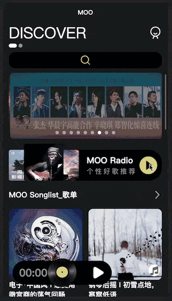
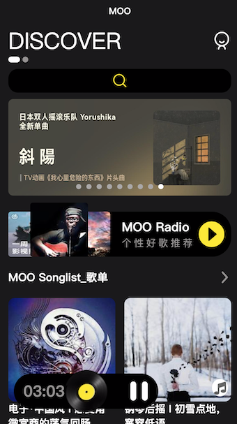
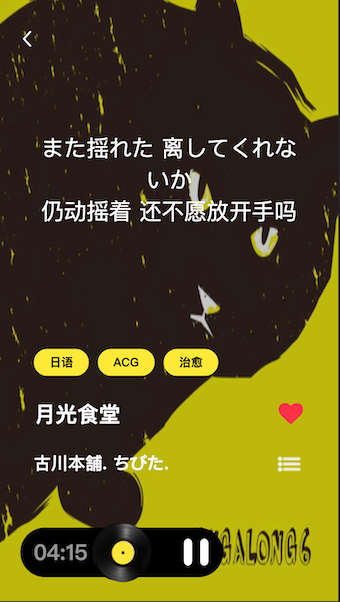

# 🎵 MOO音乐 

> **[在线体验MOO](https://moo.osrc.app/)**
>>使用uni-app开发可多端运行的音乐播放器
>>>API数据来源[NeteaseCloudMusicApi](https://github.com/Binaryify/NeteaseCloudMusicApi)

- UI组件基本上是自己实现的 + uni-ui
- vue3
- pinia
- tailwindcss
- vite
- typescript

### 看图吧

